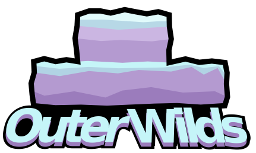

# 
Inspired by the mod `Celeste Mode` made by Krzyhau for Portal 2, this mod adds movements like climbing and dashing into the game, while disabling the suit thrusters.

You can also collect marshmellows that are scattered throughout the solar system, with hints on the pause menu to help.

The UI and the aditional texts are availabe in english and in portuguese.
